# Tribute to Professor Pavanaguru - Memorial Site

A modern, serverless memorial website dedicated to celebrating the life and legacy of Professor Pavanaguru. This platform allows family, friends, and students to share tributes, view a curated gallery of photos and videos, and preserve memories forever.

## 🌟 Features

- **Tribute Wall**: A public space for visitors to write and submit heartfelt messages.
- **Multimedia Gallery**: A responsive masonry grid displaying photos and videos.
- **Video Support**: Native playback for MP4/MOV memories.
- **Admin Dashboard**: A secure portal for moderators to manage content.
  - **Review Queue**: Approve or reject pending tributes and media uploads.
  - **Admin Inbox**: Read and manage messages sent through the contact form.
  - **Content Management**: Delete approved items or reorder gallery images.
  - **Bulk Actions**: Select multiple items to approve/reject in one go.
- **Family Residence**: Dedicated section with address and street view imagery.
- **Secure Uploads**: Direct-to-S3 uploads using signed URLs (serverless & scalable).

## 🏗️ Technical Architecture

This project is built on a fully serverless AWS architecture, ensuring high availability, zero maintenance, and cost efficiency (scaling to zero when not in use).

### Logical Diagram

```mermaid
graph TB
    %% Definitions
    classDef client fill:#f9f9f9,stroke:#333,stroke-width:2px;
    classDef aws fill:#FF9900,stroke:#232F3E,stroke-width:2px,color:white;
    classDef security fill:#DD0000,stroke:#333,stroke-width:1px,color:white,stroke-dasharray: 5 5;

    subgraph Clients ["User Interaction Layer"]
        User(["👤 Public Visitor"])
        Admin(["🛡️ Admin Moderator"])
    end

    subgraph AWS ["☁️ AWS Cloud Infrastructure"]

        subgraph Edge ["Edge Layer (Security & Caching)"]
            CF[("CloudFront Distribution<br/>(HTTPS / TLS 1.3)")]
        end

        subgraph Frontend_Storage ["Static Hosting"]
            S3_Web[("S3 Bucket: Website<br/>(React / Vite App)")]
        end

        subgraph Backend_API ["Serverless API Layer"]
            APIGW["API Gateway<br/>(HTTP API)"]

            Lambda["Node.js Lambda<br/>(Business Logic)"]
        end

        subgraph Data_Layer ["Persistence Layer"]
            DDB[("DynamoDB<br/>(Single Table Design)")]

            S3_Media[("S3 Bucket: Media<br/>(User Uploads)")]
        end

    end

    %% Flows
    User -->|HTTPS Request| CF
    Admin -->|"HTTPS Request<br/>(x-admin-key)"| CF

    %% CloudFront Routing
    CF -->|"/ (Default)<br/>[OAC Secured]"| S3_Web
    CF -->|"/prod/api/*<br/>[Verified Origin]"| APIGW
    CF -->|"/media/*<br/>[OAC Secured]"| S3_Media

    %% Integration
    APIGW -->|Proxy Integration| Lambda

    %% Backend Logic
    Lambda -->|Get/Put/Delete Items| DDB
    Lambda -->|"Get Signed URLs<br/>Delete Objects"| S3_Media

    %% Styling
    class CF,S3_Web,APIGW,Lambda,DDB,S3_Media aws;
    class User,Admin client;

    linkStyle 2 stroke:#00C851,stroke-width:2px
    linkStyle 3 stroke:#33b5e5,stroke-width:2px
    linkStyle 4 stroke:#00C851,stroke-width:2px


```



### Key Components

- **CloudFront**: The global entry point. It serves the static site and proxies API requests. It terminates SSL and enforces security headers.
- **S3 (Static Website)**: Hosts the compiled React application. It is **private** and only accessible via CloudFront OAC.
- **API Gateway**: Routes API requests to Lambda. It is protected by a custom `X-Origin-Verify` header ensuring requests come only from CloudFront.
- **Lambda**: A single Node.js function handling all business logic (CRUD operations, S3 signing, Auth).
- **DynamoDB**: Stores metadata (tributes, gallery item details, sort order).
- **S3 (Media)**: Stores uploaded images and videos.

---

## 🛠️ Tech Stack

- **Frontend**: React 18, TypeScript, TailwindCSS, Vite.
- **Infrastructure as Code**: Terraform.
- **State Management**: React Hooks.
- **Backend**: Node.js 18.x running on AWS Lambda.
- **SDK**: AWS SDK v3 for JavaScript (Modular).

---

## 🚀 Getting Started

### Prerequisites

- Node.js (v18+)
- AWS CLI (configured with valid credentials)
- Terraform (v1.0+)

### Local Development

1.  **Install Dependencies**:

    ```bash
    npm install
    ```

2.  **Run Development Server**:
    ```bash
    npm run dev
    ```
    _Note: The local frontend will try to connect to the deployed AWS backend. Ensure your `.env` file is populated (created after deployment)._

### 📦 Deployment

The project includes an automated deployment script that handles Terraform state, Lambda packaging, and Environment injection.

1.  **Run Deploy Script**:

    ```bash
    ./deploy.sh
    ```

2.  **Follow Prompts**:

    - Enter an **Admin Password** (used for the Dashboard login).
    - Confirm the AWS Region (default: `us-east-1`).

3.  **Access the Site**:
    - The script will output the **CloudFront URL** (e.g., `https://d12345.cloudfront.net`).
    - The Admin Dashboard is at `/admin`.

---

## 🛡️ Security Features

- **Origin Access Control (OAC)**: S3 buckets are completely private; no public access allowed.
- **Admin Authentication**:
  - Frontend: Password protection.
  - Backend: `x-admin-key` header validation (rotated on deployment).
- **Origin Verification**: API Gateway rejects any request not carrying the secret verified header from CloudFront, preventing direct API attacks.

## 📂 Project Structure

```
├── src/                # React Frontend Code
│   ├── pages/          # Next.js-style page routing
│   │   ├── home/       # Landing page
│   │   ├── tribute-wall/ # Public tribute submission
│   │   ├── gallery/    # Photo/Video gallery
│   │   └── admin/      # Admin dashboard
│   ├── components/     # Reusable UI components
│   └── utils/          # AWS Client & Helpers
├── terraform/          # Infrastructure as Code
│   ├── main.tf         # CloudFront & S3
│   ├── api_gateway.tf  # API Gateway configuration
│   ├── lambdas.tf      # Lambda function & IAM
│   ├── dynamodb.tf     # DynamoDB table & indexes
│   ├── lambda/         # Backend Node.js code
│   │   └── index.js    # Monolithic Lambda handler
│   └── variables.tf    # Terraform variables
├── deploy.sh           # Deployment automation script
├── .env                # Environment variables (created by deploy.sh)
└── README.md           # Project Documentation
```

---

## 🔌 API Documentation

The backend exposes a RESTful API through API Gateway. All endpoints are prefixed with `/prod`.

### Public Endpoints

#### `GET /tributes`

Fetches all approved tributes for display on the public tribute wall.

**Response:**

```json
{
  "tributes": [
    {
      "id": "uuid",
      "name": "John Doe",
      "relationship": "Former Student",
      "message": "A heartfelt tribute...",
      "date": "2024-12-20",
      "status": "approved"
    }
  ]
}
```

#### `POST /tributes`

Submit a new tribute for moderation.

**Request Body:**

```json
{
  "name": "Jane Smith",
  "relationship": "Colleague",
  "message": "Professor Pavanaguru was...",
  "email": "jane@example.com"
}
```

**Response:** `201 Created`

#### `GET /gallery`

Fetches all approved gallery items (photos/videos).

**Response:**

```json
{
  "items": [
    {
      "id": "uuid",
      "title": "Keynote Speech 2018",
      "category": "academic",
      "year": "2018",
      "src": "https://cdn.example.com/media/photo.jpg",
      "order": 0
    }
  ]
}
```

#### `POST /upload-url`

Request a presigned S3 URL for direct file upload.

**Request Body:**

```json
{
  "fileName": "photo.jpg",
  "fileType": "image/jpeg"
}
```

**Response:**

```json
{
  "uploadUrl": "https://s3.amazonaws.com/...",
  "key": "uploads/uuid/photo.jpg"
}
```

#### `POST /messages`

Submit a contact form message.

**Request Body:**

```json
{
  "firstName": "Jane",
  "lastName": "Smith",
  "email": "jane@example.com",
  "phone": "+123456789",
  "relationship": "Colleague",
  "subject": "Memorial Inquiry",
  "message": "I would like to..."
}
```

**Response:** `201 Created`

### Admin Endpoints

All admin endpoints require the `x-admin-key` header.

#### `GET /admin/pending`

Fetch pending tributes and gallery items awaiting moderation.

**Headers:** `x-admin-key: <secret>`

**Response:**

```json
{
  "tributes": [...],
  "gallery": [...]
}
```

#### `PATCH /admin/status`

Approve or reject content, or mark messages as read.

**Request Body:**

```json
{
  "type": "tributes",
  "id": "uuid",
  "status": "approved"
}
```

Or for messages:

```json
{
  "type": "message",
  "id": "uuid",
  "status": "read"
}
```

Or for bulk:

```json
{
  "type": "gallery",
  "ids": ["uuid1", "uuid2"],
  "status": "deleted"
}
```

#### `GET /admin/approved`

Fetch all approved content for management.

**Response:**

```json
{
  "tributes": [...],
  "gallery": [...]
}
```

#### `GET /admin/messages`

Fetch all visitor messages for the admin inbox.

**Response:**

```json
[
  {
    "id": "uuid",
    "firstName": "Jane",
    "lastName": "Smith",
    "email": "jane@example.com",
    "subject": "...",
    "message": "...",
    "status": "new",
    "date": "2024-12-25"
  }
]
```

#### `DELETE /admin/content?id=<uuid>`

Delete an approved item (tribute or gallery).

**Query Params:** `id` (required)

**Response:** `200 OK`

#### `PATCH /admin/gallery/order`

Reorder gallery items.

**Request Body:**

```json
{
  "items": [
    { "id": "uuid1", "order": 0 },
    { "id": "uuid2", "order": 1 }
  ]
}
```

---

## 🗄️ Data Model

### DynamoDB Schema (Single Table Design)

**Table Name:** `memorial_content`

**Primary Key:**

- `id` (String, Partition Key)

**Global Secondary Indexes:**

- **StatusIndex**: `status` (Partition Key) - Used to query items by approval status

**Attributes:**

```javascript
{
  id: "uuid",                         // Unique identifier
  type: "tribute" | "gallery" | "message", // Content type
  status: "pending" | "approved" | "new" | "read", // Moderation status

  // Tribute-specific
  name: "string",
  relationship: "string",
  message: "string",
  email: "string",
  date: "ISO-8601",

  // Gallery-specific
  title: "string",
  category: "academic" | "field-work" | "personal" | "students",
  year: "string",
  key: "s3-object-key",               // S3 path to media file
  order: 0,                           // Display order (lower = first)

  // Message-specific
  firstName: "string",
  lastName: "string",
  phone: "string",
  subject: "string"
}
```

---

## 🐛 Troubleshooting

### Common Issues

#### **Issue:** "Failed to delete item" in Admin Dashboard

**Solution:** Ensure the Lambda function has the correct IAM permissions for `dynamodb:DeleteItem` and `s3:DeleteObject`. Check CloudWatch logs for detailed error messages.

#### **Issue:** Uploads failing with 403 Forbidden

**Solution:**

1. Verify the presigned URL hasn't expired (valid for 5 minutes).
2. Check that the S3 bucket CORS policy allows uploads from your CloudFront domain.

#### **Issue:** Admin Dashboard shows "Unauthorized"

**Solution:**

1. Verify the `VITE_ADMIN_KEY` in your `.env` file matches the `ADMIN_KEY` environment variable in Lambda.
2. Clear browser cache and hard refresh (`Cmd+Shift+R` on Mac).

#### **Issue:** CloudFront returns 403 for all requests

**Solution:**

1. Ensure Origin Access Control (OAC) is properly configured.
2. Verify the S3 bucket policy grants access to the CloudFront distribution.
3. Check that the CloudFront distribution is fully deployed (status: "Deployed").

### Viewing Logs

**Lambda Logs:**

```bash
aws logs tail /aws/lambda/memorial-site-api --follow
```

**Terraform State:**

```bash
cd terraform
terraform show
```

---

## 🔧 Configuration

### Environment Variables

The `.env` file is auto-generated by `deploy.sh` but can be manually edited:

```bash
VITE_AWS_API_URL=https://d12345.cloudfront.net/prod
VITE_ADMIN_KEY=your-secret-admin-key-here
VITE_ADMIN_PASSWORD=your-admin-password
```

### Terraform Variables

Override defaults in `terraform/terraform.tfvars`:

```hcl
aws_region = "us-west-2"
project_name = "memorial-site"
admin_key = "custom-secret-key"
```

---

## 🚀 Performance Optimizations

- **CloudFront Caching**: Static assets cached at edge locations (TTL: 1 year).
- **DynamoDB On-Demand**: Auto-scales based on traffic, no provisioned capacity.
- **Lambda Cold Start Mitigation**: Single monolithic function reduces initialization overhead.
- **Direct S3 Uploads**: Bypasses Lambda for large file transfers, reducing costs.
- **Image Optimization**: Frontend uses lazy loading and responsive images.

---

## 🤝 Contributing

This is a personal memorial project, but contributions are welcome for bug fixes and feature enhancements.

### Development Workflow

1. Fork the repository
2. Create a feature branch: `git checkout -b feature/amazing-feature`
3. Make your changes
4. Test locally: `npm run dev`
5. Commit: `git commit -m 'Add amazing feature'`
6. Push: `git push origin feature/amazing-feature`
7. Open a Pull Request

### Code Style

- **Frontend**: Follow React best practices, use TypeScript strict mode
- **Backend**: ESLint with Node.js standards
- **Infrastructure**: Terraform formatting with `terraform fmt`

---

## 📜 License

This project is private and not licensed for public use. All rights reserved.

---

## 🙏 Acknowledgments

- Built with ❤️ in memory of Professor Pavanaguru
- AWS for providing a robust serverless platform
- The React and Terraform communities for excellent documentation

---

## 📞 Support

For issues or questions, please contact the project maintainer or open an issue in the repository.

**Deployed Site:** [Your CloudFront URL]  
**Admin Dashboard:** [Your CloudFront URL]/admin
